# WebDevelopmentProject_Portfolio
Welcome to my Personal Portfolio Website! This project is built using HTML, CSS, and JavaScript. It showcases my skills, projects, and services while providing an easy way for visitors to connect with me.

# Key Features

🔒 Authentication System

Register Page

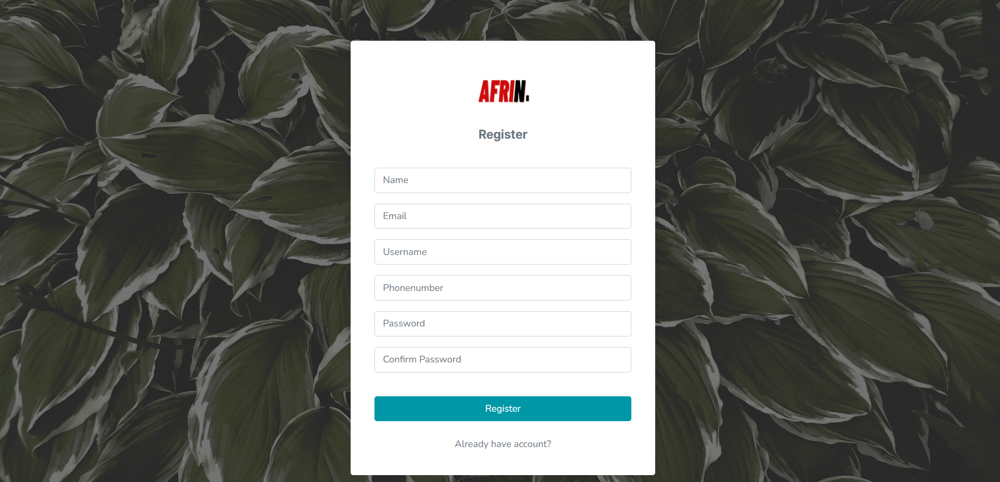

Login Page
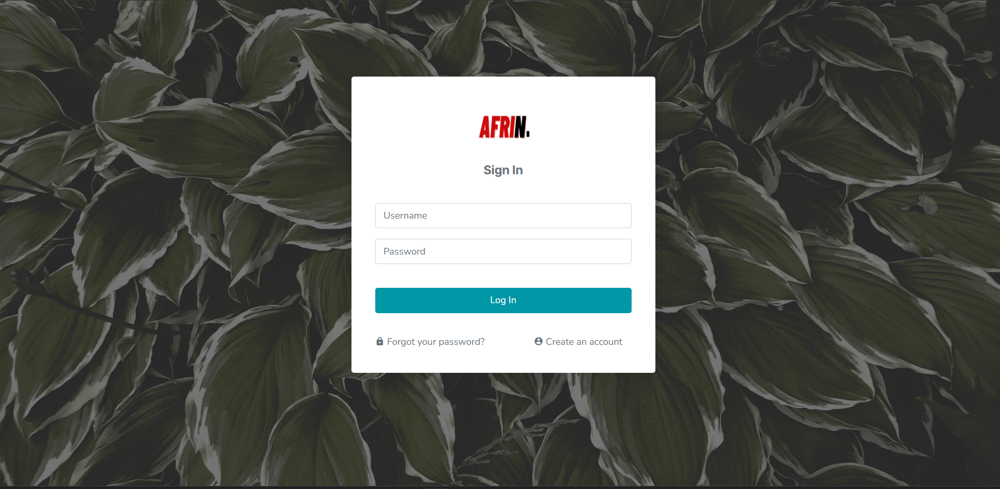

🏠 Home Section

Introduction and highlights

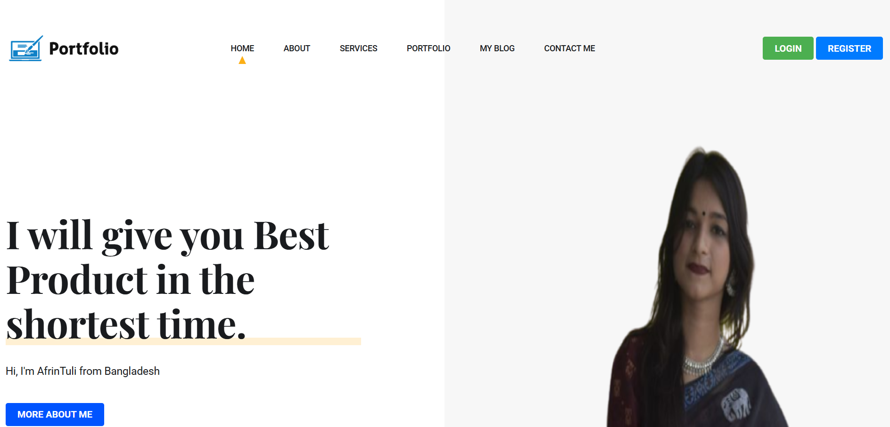

👩‍💻 About Me Section

Personal background
Skills and expertise

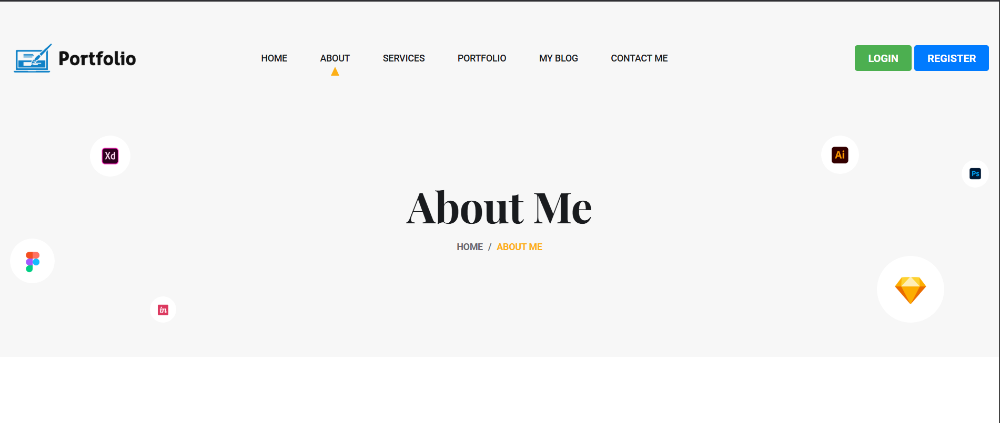

🛠️ Services Section

List of professional services 

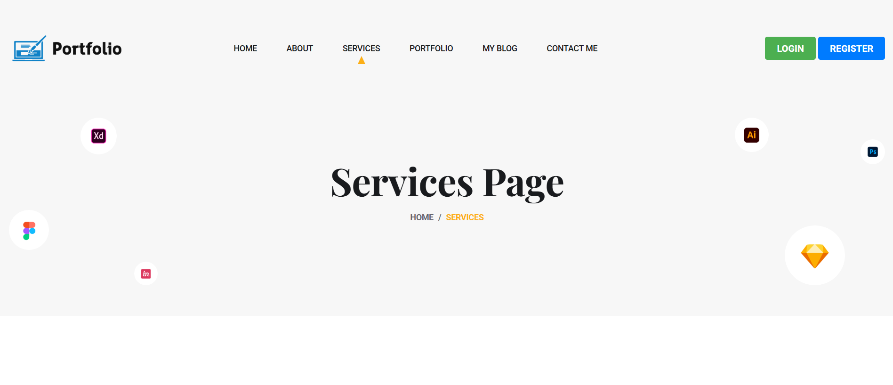

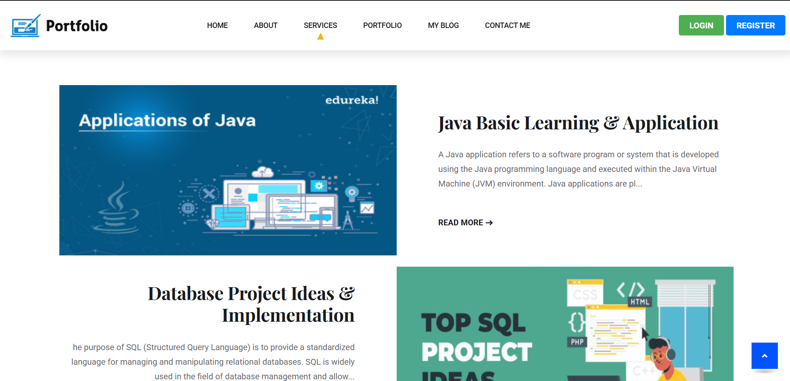

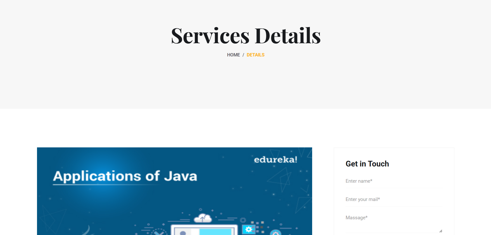

🎨 Portfolio Section

Showcases projects

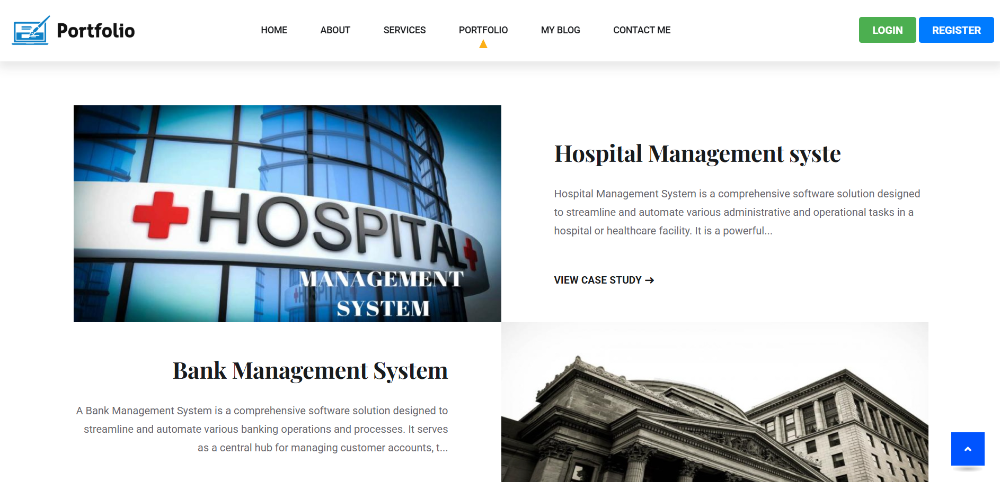

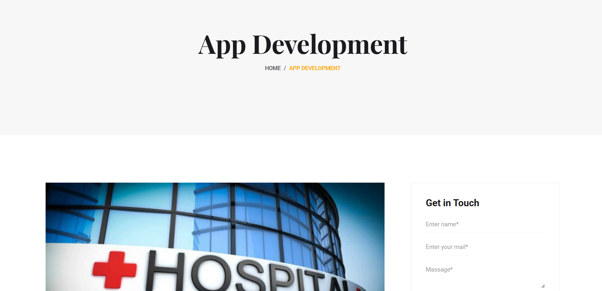

✍️ My Blog Section

Insights and articles on various topics

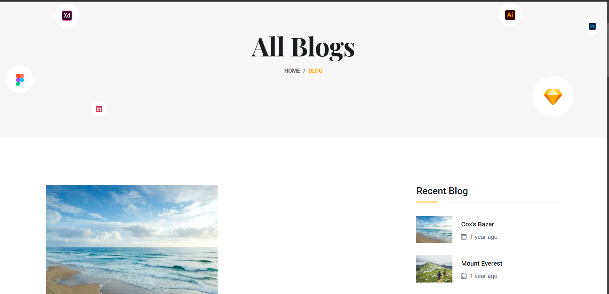

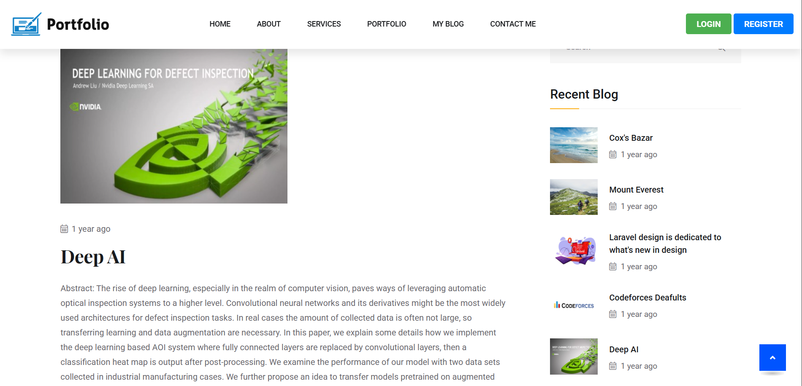

📞 Contact Me Section

Easy way for visitors to reach out

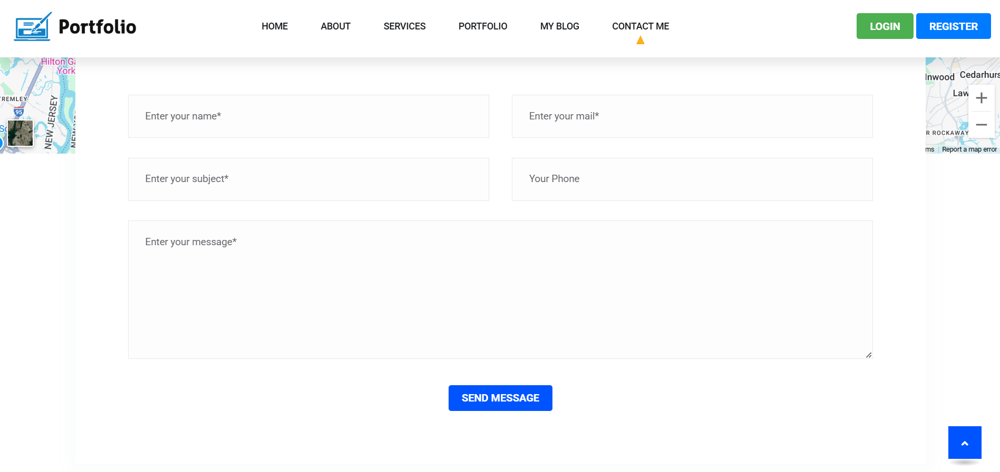

🌐 Socially Connect Section

Links to my social media profiles

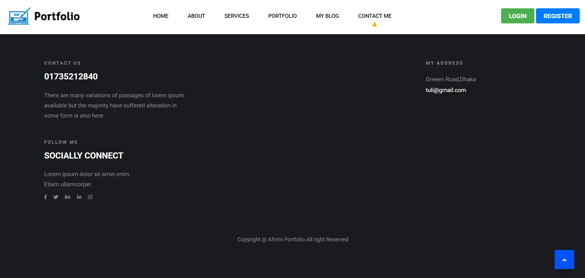
